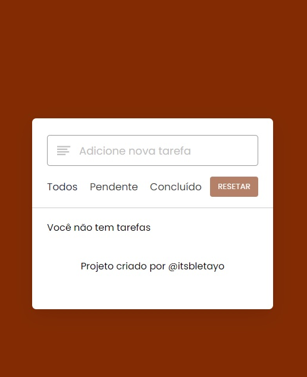

# To-Do App - lista de tarefas

Este projeto é uma lista de tarefas com marcação de tarefas concluidas e pendentes. 

## Tabela de conteúdos:

- [Geral](#geral)
  - [Screenshots](#screenshots)
  - [Links](#links)
- [Meu processo](#meu-processo)
  - [Feito com](#feito-com)
- [Autor](#autor)

## Geral

### Screenshots
Desktop Preview

### Links

- Live Site URL: (https://itsbletayo.github.io/qr-code-challenge/)

## Meu processo

### Feito com

- Marcação HTML5 semântica
- Propriedades personalizadas CSS
- Javascript

## Autor

- Github - [ItsBletaYo](https://github.com/ItsBletaYo/)
